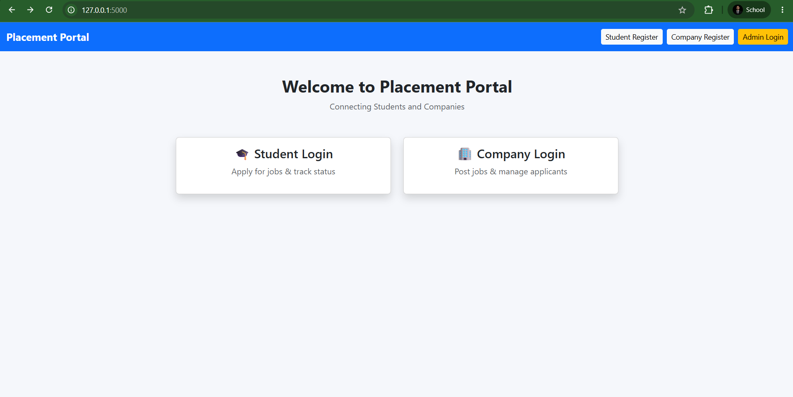
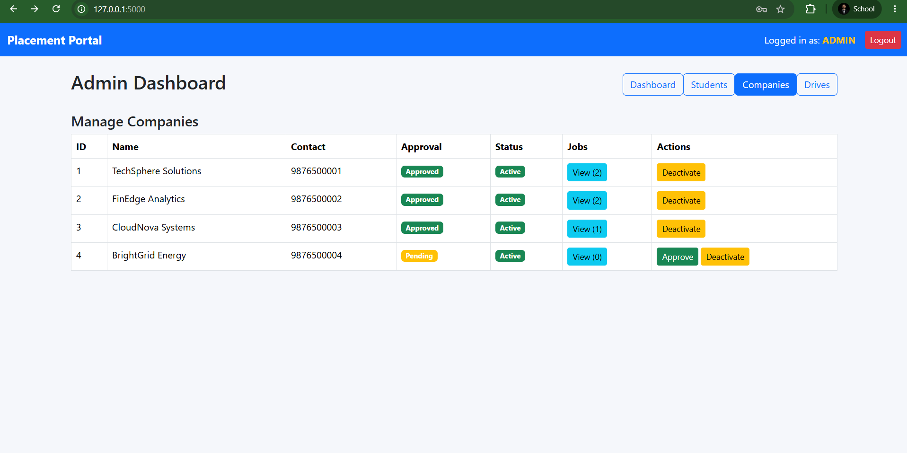
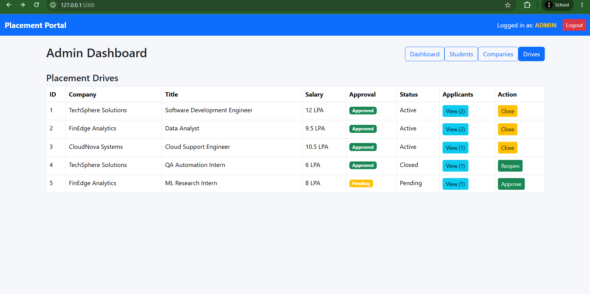
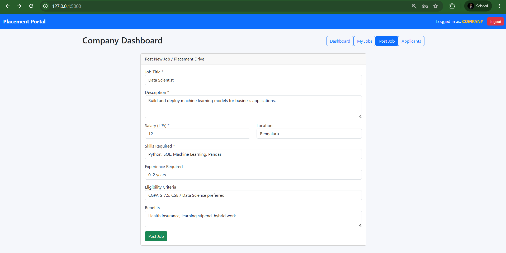
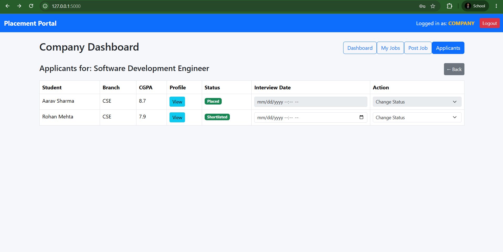
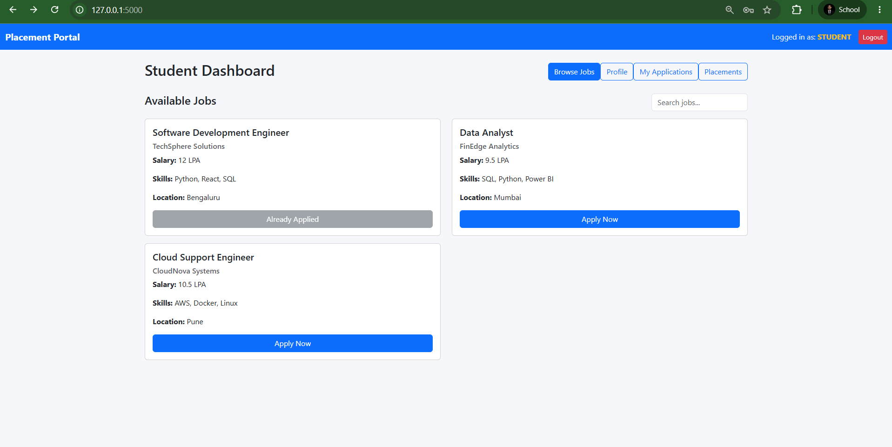
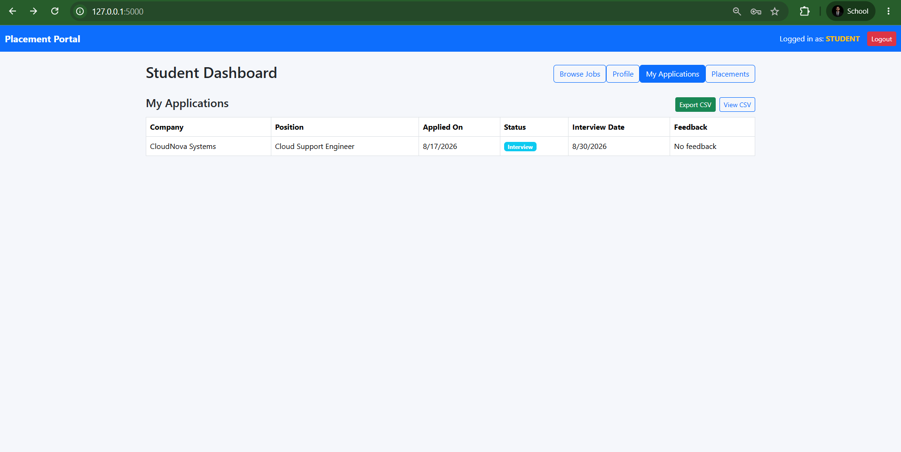
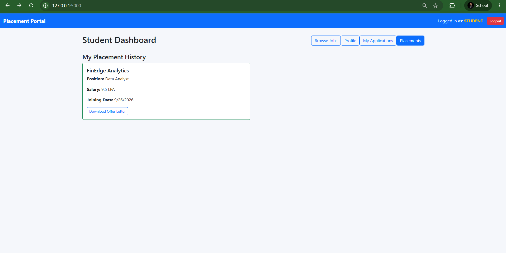

# 🎓 Placement Portal — V2 (MAD-2)

**IIT Madras BS Degree Program — Modern Application Development II Project**

A full-stack placement portal rebuilt as a **REST API + Vue 3 single-page app**, with **Redis-backed caching** and **Celery background jobs** for interview reminders and monthly reports.

This is the evolution of **[Placement Portal V1 (MAD-1)](https://github.com/mkashan-tech/placement-portal-mad1)**, which used server-rendered Flask + Jinja2. MAD-2 rebuilds the same domain with a decoupled API-driven architecture.

---

## ✨ Features

### Roles
- **Admin** — approve/deactivate companies and students, approve or reject job drives, view applicants, trigger reports
- **Company** — post and manage job drives, review applicants, update application status, view student profiles
- **Student** — apply to jobs, upload a resume, track applications and placements, view offer letters, export application history

### Core Functionality
- Session-based authentication with hashed passwords
- Role-based access control (RBAC) across all API routes
- Job drive lifecycle: create → admin approval → close/reopen
- Application lifecycle with company-side status updates
- Placement tracking with generated offer letters
- **Async background jobs (Celery + Redis):**
  - Daily interview reminder emails
  - Monthly placement report generation
  - CSV export of applications
- **Caching (Flask-Caching + Redis)** for frequently accessed endpoints
- Resume upload and download
- Student search/filtering for admins

---

## 📸 Screenshots

| Home | Admin — Companies |
|---|---|
|  |  |

| Admin — Drives (Job Approval) | Company — Post Job |
|---|---|
|  |  |

| Company — Applicants | Student — Browse Jobs |
|---|---|
|  |  |

| Student — My Applications | Student — Placements |
|---|---|
|  |  |

---

## 🛠️ Tech Stack

| Layer | Technology |
|---|---|
| Backend | Flask (REST API), Flask-SQLAlchemy |
| Frontend | Vue 3 (via CDN), Bootstrap, Axios |
| Database | SQLite |
| Background Jobs | Celery |
| Message Broker / Cache | Redis |
| Email (local dev) | Flask-Mail + MailHog |
| Auth | Werkzeug password hashing, session-based |

---

## 📁 Project Structure

```
placement-portal-mad2/
├── backend/
│   ├── app.py                  # App factory, config, blueprint registration
│   ├── celery_worker.py        # Celery app + scheduled task config
│   ├── extensions.py           # db, celery, cache, mail instances
│   ├── models/                 # User, Student, Company, Job, Application, Placement
│   ├── routes/                 # auth, admin, company, student, tasks blueprints
│   ├── tasks/                  # reminder_tasks, report_tasks, export_tasks (Celery)
│   └── utils/                  # decorators (role-based access control)
├── frontend/
│   ├── templates/index.html    # Vue 3 SPA shell
│   └── static/js/               # main.js, admin.js, company.js, student.js, login.js
├── docs/screenshots/            # UI screenshots
├── requirements.txt
├── .env.example
└── README.md
```

---

## 🚀 How to Run

This project uses Redis for caching and Celery background jobs. Redis should be running when using the caching and background-job functionality. MailHog is optional and only needed if you want to view the reminder emails locally.

```bash
# 1. Clone the repository
git clone https://github.com/mkashan-tech/placement-portal-mad2.git
cd placement-portal-mad2/backend

# 2. Create a virtual environment
python -m venv venv
source venv/bin/activate        # Windows: venv\Scripts\activate

# 3. Install dependencies
pip install -r ../requirements.txt

# 4. Configure environment variables
cp ../.env.example .env
# edit .env if needed

# 5. Start Redis (must be running before Celery)
redis-server

# 6. Run the Flask API (in one terminal)
python app.py

# 7. Run the Celery worker (in a second terminal)
celery -A celery_worker.celery worker --loglevel=info

# 8. Run Celery Beat for scheduled tasks (in a third terminal)
celery -A celery_worker.celery beat --loglevel=info
```

Open **http://127.0.0.1:5000** in your browser.

On first run, a default admin account is created automatically using the credentials in `.env`.

---

## 🔌 API Overview

| Blueprint | Prefix | Covers |
|---|---|---|
| `auth` | `/api` | Registration (student/company), login, session check, logout |
| `admin` | `/api/admin` | Company/student approval, job approval, applicant search, reports, dashboard stats |
| `company` | `/api/company` | Job creation/management, applicant review, application status updates |
| `student` | `/api/student` | Job browsing, applications, resume upload, placements, offer letters, export |
| `tasks` | `/api/tasks` | Celery task status polling |

Full route definitions are in `backend/routes/`.

---

## ⚙️ Background Jobs (Celery + Redis)

| Task | Schedule | Purpose |
|---|---|---|
| `send_interview_reminders` | Daily, 9:00 AM | Emails students with interviews scheduled for the next day |
| `generate_monthly_report` | 1st of each month, 8:00 AM | Generates a single HTML placement summary report with a company-wise breakdown |
| `export_applications_csv` | On-demand | Exports application data to CSV for admin/student download |

---

## ⚠️ Known Limitations

- Passwords were originally stored in plain text during initial development; this has since been fixed to use Werkzeug password hashing (`set_password` / `check_password`).
- Frontend uses Vue 3 via CDN (no build step / no Vue Router or Vuex) — this matched the project's scope at the time.
- SQLite is used for simplicity; a production deployment would use PostgreSQL.
- No automated tests yet.

---

## 🔄 Evolution — MAD-1 → MAD-2

| | MAD-1 | MAD-2 |
|---|---|---|
| Architecture | Server-rendered (Flask + Jinja2) | REST API + SPA (Flask + Vue 3) |
| Auth | Session-based, hashed passwords | Session-based, hashed passwords |
| Background jobs | None | Celery (reminders, reports, exports) |
| Caching | None | Redis (Flask-Caching) |
| Frontend | Bootstrap templates | Vue 3 components |

See [Placement Portal V1 (MAD-1)](https://github.com/mkashan-tech/placement-portal-mad1) for the earlier version.

---

## 👤 Author

**Mohammad Kashan**
Program: IIT Madras BS in Data Science and Applications
